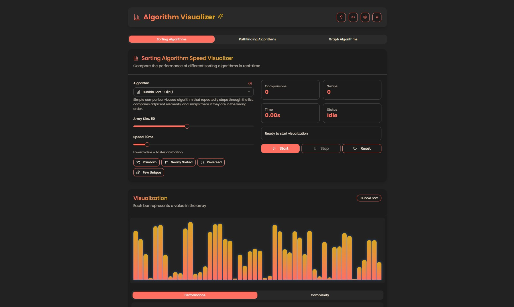

# Algorithm Visualizer

A comprehensive, interactive web application for visualizing algorithms, designed to help students, educators, and programming enthusiasts understand how various algorithms work through animated, step-by-step visualizations.



## Features

### Sorting Algorithms

- **Interactive Visualizations**: Watch how each sorting algorithm operates step by step
- **Multiple Algorithms**: Includes Bubble Sort, Selection Sort, Insertion Sort, Quick Sort, Merge Sort, Heap Sort, Counting Sort, Radix Sort, and Bucket Sort
- **Algorithm Race Mode**: Compare multiple sorting algorithms side by side in real-time
- **Customization Options**: Adjust array size, sorting speed, and visualization style
- **Array Generation**: Generate random arrays, nearly sorted arrays, reversed arrays, or arrays with few unique values
- **Statistics Tracking**: Monitor comparisons, swaps, and execution time for each algorithm
- **Sound Feedback**: Optional audio cues during sorting operations

### Pathfinding Algorithms

- **Interactive Grid**: Click and drag to create walls and obstacles
- **Algorithm Selection**: Visualize Breadth-First Search, Depth-First Search, Dijkstra's Algorithm, and A\* Algorithm
- **Maze Generation**: Automatically generate complex mazes
- **Step-by-Step Visualization**: Watch how each algorithm explores the grid
- **Speed Control**: Adjust visualization speed to observe details or see results quickly
- **Draggable Start/End Points**: Customize the pathfinding challenge

### Graph Algorithms

- **Interactive Graph Creation**: Build and modify graphs
- **Graph Traversal**: Visualize Depth-First Search and Breadth-First Search
- **Shortest Path**: Implement Dijkstra's and other shortest path algorithms
- **Minimum Spanning Tree**: Visualize algorithms like Kruskal's and Prim's
- **Connected Components**: Identify and highlight connected regions

### General Features

- **Dark/Light Mode**: Choose your preferred visual theme
- **Responsive Design**: Works on desktop and mobile devices
- **Step-by-Step Explanation**: Educational descriptions of what's happening at each step
- **Tutorial Mode**: Learn how to use the application with built-in tutorials
- **Progress Tracking**: Visual indicators show algorithm progress
- **Smooth Animations**: Powered by Framer Motion for fluid transitions

## Technologies Used

- **Next.js**: React framework for server-rendered React applications
- **React**: JavaScript library for building user interfaces
- **TypeScript**: Type-safe JavaScript
- **Tailwind CSS**: Utility-first CSS framework
- **Framer Motion**: Animation library for React
- **Radix UI**: Unstyled, accessible UI components
- **Lucide Icons**: Beautiful icon set
- **next-themes**: Theme management for Next.js

## Getting Started

### Prerequisites

- Node.js (v18 or newer)
- npm or pnpm package manager

### Installation

1. Clone the repository:

```bash
git clone https://github.com/Tanjim-Islam/algo-visualizer.git
cd algo-visualizer
```

2. Install dependencies:

```bash
npm install
# or
pnpm install
```

3. Start the development server:

```bash
npm run dev
# or
pnpm dev
```

4. Open [http://localhost:3000](http://localhost:3000) in your browser to see the application.

## Usage

### Sorting Algorithms

1. Select the "Sorting Algorithms" tab
2. Choose an algorithm from the dropdown menu
3. Adjust the array size and speed as desired
4. Click "Generate Array" to create a new random array
5. Click "Start Sorting" to begin the visualization
6. Observe the step-by-step process and statistics

### Pathfinding Algorithms

1. Select the "Pathfinding Algorithms" tab
2. Choose an algorithm from the options
3. Click and drag on the grid to create walls
4. Drag the start (green) and target (red) nodes to reposition them
5. Click "Visualize" to start the algorithm
6. Watch as the algorithm explores the grid to find the path

### Graph Algorithms

1. Select the "Graph Algorithms" tab
2. Create a graph by adding nodes and edges
3. Select an algorithm to visualize
4. Observe how the algorithm traverses or analyzes the graph

## License

This project is licensed under the MIT License - see the [LICENSE](LICENSE) file for details.

## Acknowledgments

- Inspired by various algorithm visualization tools and educational resources